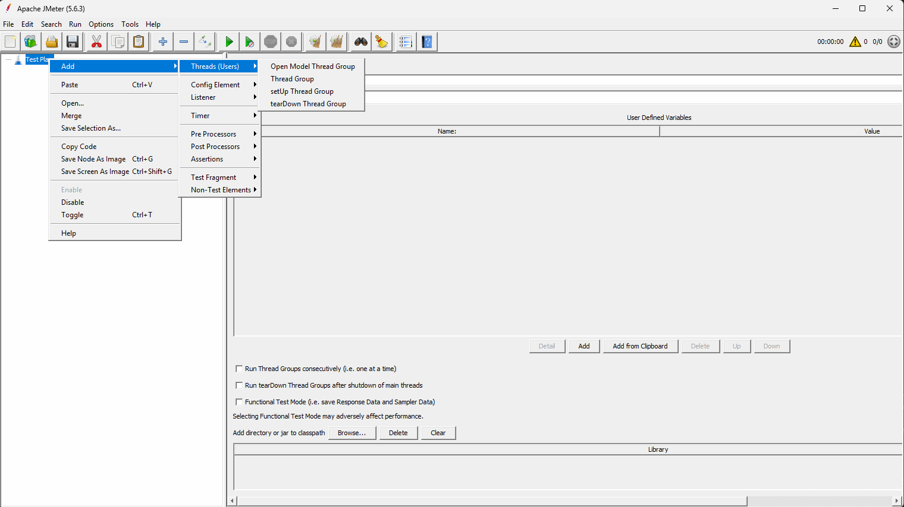
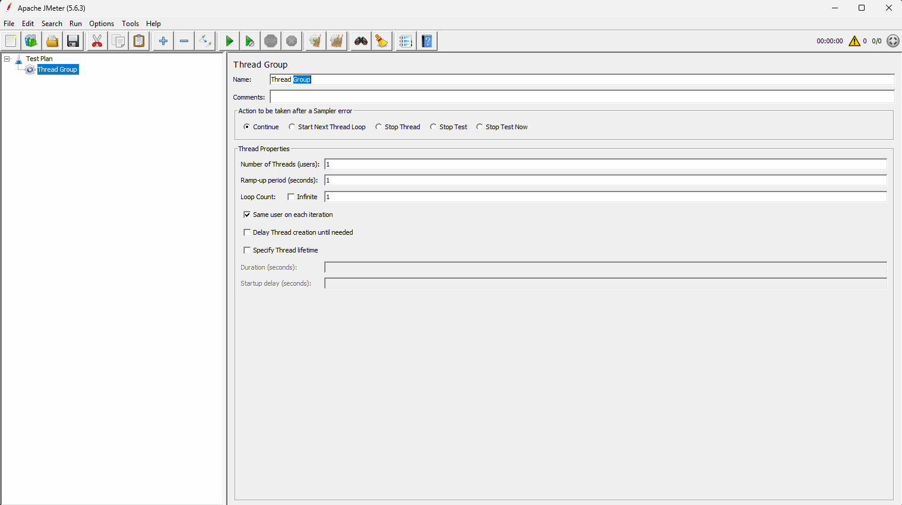

# API performance testing (Step By Step)

## What is performance testing? 
Performance testing is all about validating our application in such a way that we can see what will happen when we are going to deploy multiple users at a time. How exactly is our application responding for each and every user? 

In short, performance testing is all about how fast the application is responding to each and every instruction provided by the user, and how stable our application is when multiple people are using our application continuously. 

## Different types of performance testing ?

1. Load Testing => Load testing is all about testing the application under expected user load by gradually increasing the load. 

For example, the capacity of our application is 100 users. In this case, we are going to start from 10 users and gradually increase the user count up to 100 by taking some time interval. The main goal is just to verify the response time and stability of our application when we are gradually increasing the load up to the max limit. 

2. Stress testing => Stress testing is a concept of pushing our system beyond the limits to understand the breaking point. 

For example, the capacity of our application is 100 users. Now we are going to add 10% gradually. We are going to increase the load beyond the max limit and verify application behavior with this additional load, and we will understand what the breaking point is, where exactly the application is  not going to respond. 

3. Spike testing =>  Backtesting is all about a sudden increase or decrease in the load within the specific interval. 

The best example for this play testing is a flash sale happening on Amazon or Flipkart at midnight. 

4. Soak Testing / Endurance Testing => Endurance testing, or soak testing, is all about running the application for a longer duration continuously. The main goal is to understand the application's performance and the degradation of the application's performance when we are going to maintain the same load for so long. 

For example, I am going to log in with 100 users, and these 100 users will continue to log in and work on this particular application for so long. They are not going to log out immediately. They are going to continuously work on the application, and we are going to verify how our application is responding. 

## Why is performance testing so important? 
Performance testing is very important because, even though your application is working really great, if your application's performance is poor, then most of the users will leave your application immediately. 

## What are all the different tools available in the market to do performance testing? 
1. Apache JMeter 
2. Load Runner 
3. BlazeMeter 

## What is JMeter? 
JMeter is an open-source performance testing tool which can help us to validate our API performance by applying different performance testing techniques. 

## How will JMeter work? 
JMeter is a tool that will verify our application's performance by simulating multiple users. 

## How to perform API performance testing using JMeter ? (step by step )

- Prerequisite :
We need to install JDK before running JMeter. (https://download.oracle.com/java/27/latest/jdk-27_windows-x64_bin.exe)

- Download JMeter (https://dlcdn.apache.org//jmeter/binaries/apache-jmeter-5.6.3.zip)

## How to launch the JMeter tool ?

- Extract the files from the jmeter.zip file. 
- Navigate to the subfolder 'bin'  
- Double-click on the 'ApacheJMeter.jar' file 
- Wait until the JMETER tool is going to launch with a test plan template. 

## What is a test plan in JMeter? 

A test plan in JMeter is a template or a root container that defines what to test, how to test, and with how many users you want to validate your application APIs. 

Within the test plan, we can add
- Thread Group (Number of threads or users we want to deploy on our application to validate the API performance )
- Samplers ( Request sent by the virtual user to test the application performance )
- Listeners ( Listener is a component that is going to help us to monitor and capture the test results. )
- Configuration elements (Configuration elements are all about environment variables and respective values, etc. )
- Assertions ( Assertions are useful to compare expected values versus actual values )

## Sample Test Plan

## What is a thread group? 
Thread group is a template where we are going to add:
- the total number of virtual users you want to deploy
- the ramp-up period ( How much time do we want to use to deploy these money users? )
- how many times you want to repeat this entire process

## Sample thread group 

1. Name : Name of your project or purpose of performance testing 
For example, API performance testing for GitHub or Git API validation. 

2. Comments : Short description about your project and the APIs that you are planning to validate
For example, as part of this test plan, I am planning to validate different scenarios related to GitHub repositories and respective API performance.  

3. Action to be taken after a sampler error : What should happen when your request is failing in the middle of the execution? 
continue (default) : Ignore the error and continue the execution. 
Start next thread loop => Stop the current iteration and start the next iteration. 
Stop thread => Stop the entire thread execution for the current user. 
Stop test => Stop the entire test execution. 

4. Thread properties (Most important part of the thread group )